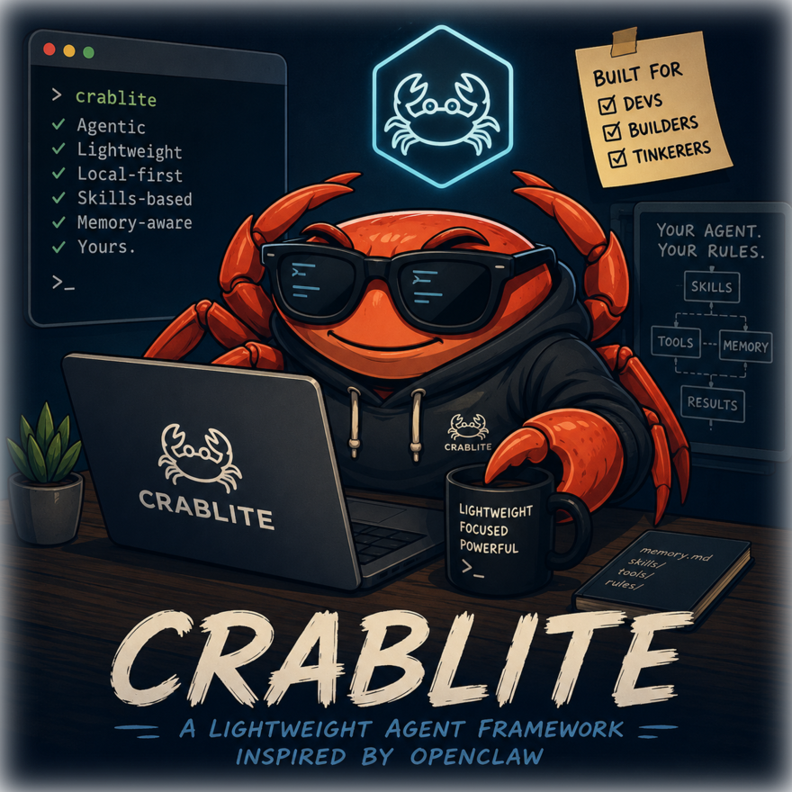

<div align="center">



<p>
  = 20">
  
  
  
  
  
</p>

</div>

A **lightweight, faithful distillation of [OpenClaw](https://github.com/openclaw/openclaw)** — a
personal AI assistant that lives on WhatsApp, remembers things by writing plain Markdown files,
learns which of those notes matter and promotes them into long‑term memory on its own, extends
itself with folder‑based skills, spawns subagents when work should be delegated, and talks to
Google (Gmail + Sheets). One `docker compose up` and it's running.

> **Philosophy, inherited verbatim from OpenClaw:**
> *"Skills own workflows; root owns hard policy and routing."* and
> *"It remembers things by writing plain Markdown files — there is no hidden state."*

crablite keeps that **soul** and throws away the platform machinery. It is a few small TypeScript
files you can read in an afternoon — not a 14,000‑file monorepo.

---

## What makes it crablite

- **File‑based memory you can read and edit.** `SOUL.md`, `IDENTITY.md`, `USER.md`, `MEMORY.md`, plus
  dated notes in `memory/`. No database, no hidden state. Everything is Markdown in one folder.
- **Self‑learning ("dreaming").** Notes you keep coming back to are automatically promoted into
  always‑loaded `MEMORY.md` each night — with provenance and a human‑readable `DREAMS.md` diary.
- **Skills are folders.** Drop a `SKILL.md` into `skills/` and the agent can use it. Only the
  name + description are always in context; the body is read on demand (progressive disclosure).
- **Autonomous subagents.** The agent can call `spawn_subagent` itself to delegate a bounded task to
  a fresh, isolated child agent.
- **Proactive, not just reactive.** It schedules reminders/follow‑ups (`schedule_reminder`) and a
  heartbeat delivers them on its own; an optional daily check‑in can greet you with what matters.
- **Sees and hears.** On WhatsApp it reads **images** (vision) and transcribes **voice notes** — both
  through your Codex credential, no extra key (just like OpenClaw).
- **Remembers recent days.** A fresh conversation is seeded with the last couple of days of notes, so
  it already knows what happened without you having to remind it.
- **WhatsApp first, CLI for dev.** Chat with it on WhatsApp; debug it in your terminal — same code path.
- **Google built in.** Gmail (search/read/summarize/draft/**send after you confirm**) and Sheets
  (read/write/update) via the `gog` CLI wrapped as a skill.
- **Codex OAuth.** Sign in with your ChatGPT/Codex account. No API keys.
- **Docker‑first.** `docker compose up`.

---

## Quick start

### Option A — Docker (recommended)

```bash
cp .env.example .env          # REQUIRED: set CRABLITE_ALLOW_FROM to your number (closed by default)
docker compose build          # on Apple Silicon add: --build-arg GOG_ASSET=gogcli_linux_arm64.tar.gz
docker compose run --rm crablite login     # sign in with ChatGPT/Codex (device code or paste a URL)
docker compose up                          # starts WhatsApp; a QR appears in the logs — scan it
```

Scan the QR from the `docker compose up` logs in **WhatsApp → Settings → Linked Devices → Link a
device**. Then message your own number — the crab replies.

### Option B — Local (Node ≥ 20)

```bash
pnpm install
pnpm crablite login      # sign in with Codex
pnpm crablite chat       # talk in the terminal (no WhatsApp needed) — great for development
pnpm crablite whatsapp   # run on WhatsApp (scan the QR printed to the terminal)
pnpm crablite doctor     # show status: auth, gog, skills, config, paths
```

> **You need a ChatGPT/Codex account** (that's the only model auth crablite implements, by design).

---

## First‑run setup

1. **Codex login** — `crablite login`. It tries the device‑code flow (nicest, headless‑friendly).
   If your account can't use it, it falls back to a browser flow: open the printed URL, sign in, and
   paste the redirected `localhost:1455/...` URL (or just the `code`) back into the terminal. Tokens
   are stored in `~/.crablite/auth/codex.json` (mode `0600`) and auto‑refreshed.
2. **WhatsApp** — `crablite whatsapp` (or `docker compose up`) prints a QR. Link it as a device.
   Session credentials persist in `~/.crablite/auth/whatsapp/`.
3. **Google (optional, for Gmail/Sheets)** — the `gog` skill activates automatically when the `gog`
   binary is present (it's baked into the Docker image). Set it up once:
   ```bash
   # inside the container:  docker compose exec crablite sh -c '...'
   gog auth credentials /data/client_secret.json          # a Google Cloud "Desktop app" OAuth file
   gog auth add you@gmail.com --services gmail,sheets,calendar,drive,docs
   ```
   Put `client_secret.json` in the state volume (`/data` in Docker, `~/.crablite` locally). Set
   `GOG_KEYRING_PASSWORD` in `.env` so tokens survive restarts.

---

## Talking to it

Just talk. Some built‑in commands (work in WhatsApp and the CLI):

| Command | Effect |
|---|---|
| `/help` | list commands |
| `/reset` | start a fresh conversation (memory is untouched) |
| `/dream` | run the self‑learning promotion right now |

Examples:

- *"Remember that I prefer emails kept under 5 lines."* → it writes that to today's note; over time it
  gets promoted into `MEMORY.md`.
- *"What did we decide about the Q3 budget?"* → it runs `memory_search` first, then answers.
- *"Draft a reply to the last email from Ana and show me before sending."* → it uses the `gog` skill,
  creates a draft, and waits for your **explicit yes** before sending.
- *"Pull the totals from the 'Sales' tab of &lt;sheet&gt; and summarize."* → `gog sheets get ... --json`.

---

## The memory model

Everything lives under `~/.crablite/workspace/` (or `/data/workspace` in Docker) as Markdown:

```
workspace/
  AGENTS.md      operating policy & routing         (injected, order 10)
  SOUL.md        persona & tone                     (injected, order 20)
  IDENTITY.md    structured self (name, emoji, vibe) (injected, order 30)
  USER.md        durable facts about you            (injected, order 40)
  MEMORY.md      long‑term memory                   (injected, order 70)  ← curated by dreaming
  DREAMS.md      the learning diary                 (not injected)
  memory/
    2026-07-10.md            daily/working notes (searchable, not injected wholesale)
    .recall.json             which notes get recalled (the dreaming signal)
  skills/                    your own dropped‑in skills
```

- **Recent context:** when a new conversation starts, the last ~2 days of daily notes are injected, so
  the agent already knows what happened recently without having to search.
- **Reading:** the agent uses `memory_search` (lexical search over `MEMORY.md` + `memory/*.md`) and
  `memory_get` before answering questions about you or past work.
- **Writing:** it appends durable facts to `memory/<today>.md`. Before context fills up, a silent
  **memory‑flush** turn saves anything important so it isn't lost.
- **Dreaming:** nightly (configurable hour), notes that were recalled often, across varied queries,
  are ranked and the strongest are **rehydrated from the live file** and promoted into `MEMORY.md`
  with a tag like `[score=0.62 recalls=3 source=memory/2026-07-09.md:3-3]` and an idempotency marker.
  A first‑person entry is written to `DREAMS.md`. `MEMORY.md` is auto‑compacted (oldest promotions
  drop first; your hand‑written content is never touched).

You can open, diff, and edit any of these files by hand at any time.

---

## Skills

A skill is a folder with a `SKILL.md`. Drop it into `workspace/skills/` (highest priority) or the
bundled `skills/` directory. Minimal example:

```markdown
---
name: weather
description: Get the current weather for a place. Use when asked about weather or temperature.
metadata:
  crablite:
    requires:
      bins: ["curl"]
---

# weather
Run `curl -s 'wttr.in/<place>?format=3'` and summarize the result in one sentence.
```

- `description` is the **only** text the model sees up front — make it a good trigger.
- `requires.bins` gates the skill: if the binary isn't installed, the skill is hidden.
- The model reads the body on demand via the `read` tool and follows it (usually running commands
  with `exec`). OpenClaw's `metadata.openclaw` block is also honored, so its skills drop in unchanged.

Bundled skills: **gog** (Gmail + Sheets), **weather**, **web-search**. Run `crablite doctor` to see
which are eligible.

---

## Subagents

The agent can delegate by calling the `spawn_subagent` tool itself (no user command needed). The
child runs the same loop in an isolated context with its own subagent system prompt, returns its
final message to the parent, and is bounded by a depth cap (`maxSubagentDepth`, default 2). ACP and
background/parallel children from OpenClaw are intentionally dropped.

## Proactivity (reminders & heartbeat)

crablite isn't only reactive — this is OpenClaw's "commitments → heartbeat" idea, distilled:

- When the agent commits to a follow‑up, it calls **`schedule_reminder`** (e.g. *"remind me Friday to
  send the invoice"*). The reminder is stored in `~/.crablite/reminders.json`.
- A **heartbeat** loop checks every minute and, when a reminder is due, delivers it **on its own** —
  it runs a short proactive turn in that chat so the message is natural and in‑character.
- Optionally, set `CRABLITE_PRIMARY_CHAT` (a WhatsApp chat id) and the agent will do a **once‑daily
  check‑in** at `heartbeatHour`, guided by `workspace/HEARTBEAT.md`. By default it stays quiet
  (`NO_REPLY`) unless there's something genuinely worth telling you.

## Media (images & voice notes)

On WhatsApp the agent handles inbound media:

- **Images** are sent to the model as vision input (through Codex — no extra key).
- **Voice notes** are transcribed through your **Codex credential** (model `gpt-4o-transcribe` at the
  Codex `/audio/transcriptions` endpoint) — **no extra key**, exactly like OpenClaw's
  `openai-codex` transcription provider. The transcript is added to the message *and* saved to memory.

---

## Configuration

Config is `~/.crablite/config.json`; environment variables always override it.

| Key / env | Default | Meaning |
|---|---|---|
| `model` / `CRABLITE_MODEL` | `gpt-5.5` | model sent to the Codex Responses API |
| `agentName` / `CRABLITE_AGENT_NAME` | `Crab` | persona handle + group @mention trigger |
| `allowFrom` / `CRABLITE_ALLOW_FROM` | `[]` (closed) | WhatsApp senders allowed. **Empty ⇒ ignores everyone** — set your number(s). `"*"` = anyone (warned). |
| `dreaming` / `CRABLITE_DREAMING` | `true` | nightly self‑learning on/off |
| `dreamHour` | `3` | local hour to run dreaming |
| `requireMentionInGroups` | `true` | in groups, only reply when mentioned |
| `debounceMs` | `0` | coalesce rapid messages |
| `idleTimeoutMs` | `120000` | abort a turn if the model stalls |
| `maxToolRounds` | `12` | tool‑call rounds per turn |
| `maxSubagentDepth` | `2` | subagent recursion cap |
| `heartbeatChat` / `CRABLITE_PRIMARY_CHAT` | `""` | chat id for the daily proactive check‑in (off if empty) |
| `heartbeatHour` | `8` | local hour for the check‑in |
| `CRABLITE_STATE_DIR` | `~/.crablite` | where everything lives |

---

## Architecture (in one breath)

`channel (WhatsApp | CLI) → handle (admission, dedupe, debounce) → runTurn → runAgentLoop (Codex
Responses API ↔ tools) → stream/persist`. Memory, skills, and subagents plug into the loop as tools
and prompt sections. The full map is in [`docs/architecture.md`](docs/architecture.md); deployment
details in [`docs/deployment.md`](docs/deployment.md).

`src/` layout: `codex/` (auth + Responses transport), `agent/` (loop, tools, system‑prompt, subagent,
runner, prune, reminders), `memory/` (workspace, search, recall, dreaming, flush), `skills/` (loader),
`channels/` (whatsapp, cli), `session/` (store), `net/` (SSRF‑safe fetch), `util/` (lock), `media/`
(stt), plus `handle.ts`, `heartbeat.ts`, `dreaming-cron.ts`, `config.ts`, `paths.ts`, `index.ts`.

---

## Development

```bash
pnpm install
pnpm crablite chat        # run the agent in your terminal
pnpm typecheck            # tsc --noEmit (strict)
pnpm test                 # Vitest unit suite
pnpm test:coverage        # coverage report (thresholds enforced)
```

Tests live in `test/` and cover the core logic — memory & dreaming, the tool sandbox, path
containment, the SSRF guard, the agent loop, Codex auth/refresh, the Responses SSE parser, inbound
admission, reminders — mocking only the network (model/transport) and hardware (WhatsApp/TTY).
**Current coverage: ~91% of lines** (≥75% enforced in CI via `vitest.config.ts`).

---

## Features

- A conversational agent on **WhatsApp** (baileys, QR login), with a **CLI** for development and debugging.
- **File-based memory** you can read and edit: soul, identity, user profile, dated working notes, and a long-term `MEMORY.md` — no hidden state.
- **Self-learning ("dreaming")**: notes you keep coming back to are promoted into long-term memory each night, with provenance and a `DREAMS.md` diary.
- Reading, writing, searching and compacting memory straight from the conversation.
- **Folder-based skills** (`SKILL.md`) with progressive disclosure and binary gating.
- **Autonomous subagents** for delegated, well-scoped work.
- **Proactivity**: scheduled reminders delivered on their own by a heartbeat, plus an optional daily check-in.
- **Startup context**: the last couple of days of notes seeded into a fresh conversation.
- **Inbound media**: images (vision) and voice notes (transcribed) — both through your Codex credential.
- **Gmail & Google Sheets** via the `gog` skill, with draft → confirm → send for email.
- **Codex (ChatGPT) OAuth** as the only model auth (device-code + PKCE, auto-refresh).
- **Docker-first**: a single `docker compose up`.

---

## Troubleshooting

- **Codex transport / model errors (HTTP 4xx from the model).** crablite talks to
  `https://chatgpt.com/backend-api/codex/responses` using the OpenAI Responses API shape and the same
  headers OpenClaw/Codex use. That contract is private and can change. Everything is isolated in
  `src/codex/responses.ts` (and `auth.ts`) — headers, model id, and base URL are easy to adjust.
  Override the endpoint with `CRABLITE_CODEX_BASE_URL` and the model with `CRABLITE_MODEL` if needed.
- **`crablite login` says device code isn't enabled.** That's fine — it falls back to the browser
  flow: open the URL, sign in, paste the redirected URL back.
- **WhatsApp keeps asking for a QR / "logged out".** Delete `~/.crablite/auth/whatsapp/` and re‑link.
- **Gmail/Sheets skill missing from `doctor`.** The `gog` binary isn't on `PATH`. In Docker it's baked
  in; on Apple Silicon build with `GOG_ASSET=gogcli_linux_arm64.tar.gz`. Locally, install
  [`gog`](https://gogcli.sh).
- **It won't reply in a group.** By default it only replies when mentioned by name. Set
  `requireMentionInGroups: false` or mention it.

---

## Security notes

crablite wires an LLM to a shell, your files, the web, and your email — so access control matters. It
ships hardened after a security audit:

- **Allowlist is closed by default** (`allowFrom: []`): the agent ignores everyone until you set
  `CRABLITE_ALLOW_FROM` to your own number(s). `"*"` (anyone) is an explicit, loudly‑warned opt‑in.
- **`exec` runs shell commands** — appropriate for a personal agent. In Docker it runs as a **non‑root
  user with all capabilities dropped**, `no-new-privileges`, and memory/PID limits; only admitted
  senders reach it.
- **`read`/`write`/`edit` are confined** to the workspace (plus, for `read`, the bundled skills dir) —
  they cannot reach your tokens. **`web_fetch` is SSRF‑guarded** (rejects private/loopback/metadata
  addresses, caps size, times out) and its output is fenced as untrusted **data, not instructions**.
- **Secrets** (Codex tokens, WhatsApp creds, Google keyring) live in the state dir with `0600`
  permissions. Keep the state volume private. Never commit `.env` or `data/`.
- **Email/calendar sends require explicit confirmation** by policy (draft → you say yes → send).

> A personal agent that runs shell is still powerful: keep the allowlist to your own number(s) and
> the state volume private. See `docs/architecture.md` for the full posture.

## License

MIT.
